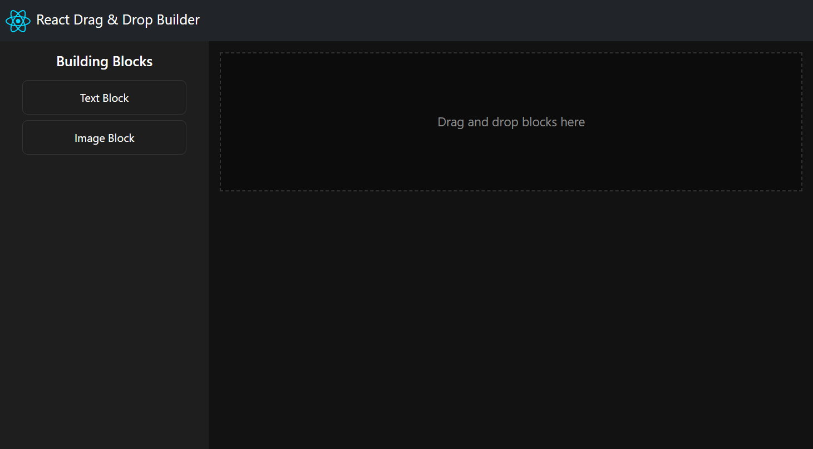

# React Drag & Drop Builder

This project is a drag-and-drop builder application using React, TypeScript, and Vite. It allows users to create layouts by dragging blocks (Text or Image) from a palette into a container, where they can rearrange or edit the blocks.



## Demo

Check out the live demo: [https://react-drag-drop-builder.vercel.app/](https://react-drag-drop-builder.vercel.app/)

## Features

- **Vite**: Fast and optimized build system.
- **React + TypeScript**: Modern development with type safety.
- **Drag and Drop**: Powered by `@hello-pangea/dnd` for smooth drag-and-drop functionality.
- **Palette Cloning**: Dragging a block from the palette creates a copy, leaving the original in place.
- **Dynamic Block Management**: Add, reorder, edit, or delete blocks in the container.
- **Bootstrap**: Utilized for responsive design and pre-built components.

## Getting Started

### Prerequisites

Make sure you have the following installed:

- [Node.js](https://nodejs.org/) (v16 or higher)
- [Yarn](https://yarnpkg.com/)

### Installation

1. Clone the repository:

    ```sh
    git clone https://github.com/acalic/react-drag-drop-builder.git
    cd react-drag-drop-builder
    ```

2. Install dependencies using Yarn:

    ```sh
    yarn install
    ```

3. Start the development server:

    ```sh
    yarn dev
    ```

4. Open the application in your browser at [http://localhost:5173](http://localhost:5173).

### Running Tests

To run the unit tests, use the following command:

```sh
yarn test
```

### Build for Production

To create an optimized production build, run:

```sh
yarn build
```

### Preview Production Build

After building, you can preview the production build locally:

```sh
yarn preview
```

## Project Structure

- `src/components`: Contains reusable components like `BuilderPalette` and `DragDropContainer`.
- `src/types`: Type definitions for blocks and other data structures.
- `src/styles`: SCSS files for styling.

## Dependencies

- `react`, `react-dom`: Core libraries for building the UI.
- `@hello-pangea/dnd`: Drag-and-drop library.
- `uuid`: For generating unique block IDs.

## Scripts

- `yarn dev`: Start the development server.
- `yarn build`: Build the project for production.
- `yarn preview`: Preview the production build.
- `yarn test`: Run unit tests.

## License

This project is licensed under the MIT License.

Feel free to contribute to this project by submitting issues or pull requests!